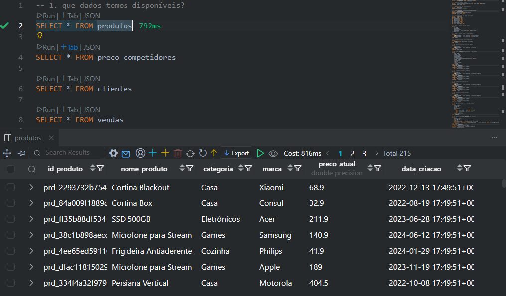

# 📚 Dia 1: SQL & Analytics | Jornada de Dados

## 📖 O que é SQL?

**SQL** (Structured Query Language) é a linguagem padrão para trabalhar com bancos de dados relacionais. É a ferramenta que permite:

- ✅ **Consultar dados** - Extrair informações de tabelas
- ✅ **Analisar dados** - Calcular métricas, agregações e estatísticas
- ✅ **Manipular dados** - Inserir, atualizar e deletar registros
- ✅ **Estruturar dados** - Criar tabelas, relacionamentos e índices

**SQL não é uma linguagem de programação tradicional.** É uma linguagem declarativa: você descreve **o que quer**, não **como fazer**. O banco de dados decide a melhor forma de executar.

```sql
-- Você diz: "Quero os produtos mais caros"
SELECT nome_produto, preco_atual
FROM produtos
ORDER BY preco_atual DESC
LIMIT 10;

-- O banco decide como buscar isso de forma eficiente
```

---

## 💼 Mercado de SQL

SQL é uma das habilidades mais demandadas no mercado de dados e tecnologia:

### 📊 Por que SQL é importante?

1. **Universalidade**: Quase todos os bancos de dados relacionais usam SQL
2. **Demanda de mercado**: Uma das habilidades mais procuradas em vagas de dados
3. **Base para outras ferramentas**: BI tools (Power BI, Tableau), Python (pandas), dbt, etc.
4. **Carreira**: Analista de Dados, Cientista de Dados, Engenheiro de Dados — todos precisam de SQL

### 🎯 Onde SQL é usado?

- **Análise de Negócio** — Responder perguntas estratégicas
- **Business Intelligence** — Criar dashboards e relatórios
- **Data Science** — Preparar e explorar dados
- **Data Engineering** — Transformar dados com dbt, pipelines ETL/ELT
- **Desenvolvimento** — Backend de aplicações

---

## 🗄️ Nossas Tabelas

📎 Nossos dados: [Google Sheets](https://docs.google.com/spreadsheets/d/1V_ICue9zOznu-8WlCUpb0ZmHEE5NZcqgV1_Gw4RIJp4/edit?usp=sharing)

O banco tem **4 tabelas** de um sistema de vendas:

```
Banco de Dados: E-commerce
├── vendas               (~3.000 registros)  — Transações de venda
├── produtos             (200 registros)     — Catálogo de produtos
├── clientes             (50 registros)      — Clientes cadastrados
└── preco_competidores   (~680 registros)    — Preços dos concorrentes
```

### 📋 vendas

| Coluna | Tipo | Descrição |
|--------|------|-----------|
| `id_venda` | TEXT | ID único da venda |
| `data_venda` | TIMESTAMP | Data e hora da venda |
| `id_cliente` | TEXT | FK → clientes |
| `id_produto` | TEXT | FK → produtos |
| `canal_venda` | TEXT | `ecommerce` ou `loja_fisica` |
| `quantidade` | INTEGER | Unidades vendidas |
| `preco_unitario` | NUMERIC | Preço unitário na venda (R$) |

### 📋 produtos

| Coluna | Tipo | Descrição |
|--------|------|-----------|
| `id_produto` | TEXT | ID único do produto |
| `nome_produto` | TEXT | Nome do produto |
| `categoria` | TEXT | Categoria (Eletrônicos, Cozinha, Tênis...) |
| `marca` | TEXT | Marca do produto |
| `preco_atual` | NUMERIC | Preço atual em R$ |
| `data_criacao` | TIMESTAMP | Data de criação |

### 📋 clientes

| Coluna | Tipo | Descrição |
|--------|------|-----------|
| `id_cliente` | TEXT | ID único do cliente |
| `nome_cliente` | TEXT | Nome do cliente |
| `estado` | TEXT | Estado (UF) |
| `pais` | TEXT | País |
| `data_cadastro` | TIMESTAMP | Data de cadastro |

### 📋 preco_competidores

| Coluna | Tipo | Descrição |
|--------|------|-----------|
| `id_produto` | TEXT | FK → produtos |
| `nome_concorrente` | TEXT | Nome do concorrente |
| `preco_concorrente` | NUMERIC | Preço do concorrente (R$) |
| `data_coleta` | TIMESTAMP | Data da coleta do preço |

### 🔗 Relacionamentos

```
vendas.id_produto ──────→ produtos.id_produto
vendas.id_cliente ──────→ clientes.id_cliente
preco_competidores.id_produto ──→ produtos.id_produto
```
---

## ❓ Perguntas de Negócio Respondidas

### 🔍 Explorar dados
1. Que dados temos disponíveis?


2. Quais os produtos mais caros?

3. Quais os produtos mais caros?

4. Quais as maiores vendas?


### 🔎 Filtrar e transformar
4. Quais vendas são do e-commerce?

5. Quais produtos custam entre R$ 100 e R$ 500?

6. Existem vendas com dados inválidos?

7. Qual a receita de cada venda?


### 📈 Métricas e agrupamentos
8. Qual a receita total e ticket médio?

9. Quantos clientes únicos compraram?

10. Qual a receita por canal de venda?


### 🔗 Análises com JOINs
11. Quais produtos foram vendidos e para quem?

12. Qual a receita por categoria?

13. Qual a receita por marca?

14. Qual a receita por estado?


### 🏷️ Classificações e rankings

15. Qual a faixa de preço de cada produto?

16. Qual o ranking dos produtos por receita?

17. Qual o percentual de receita por canal?


### 🏆 Análise completa
18. Como montar um KPI completo estilo dashboard?


---
